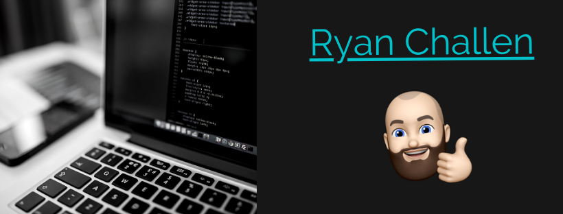

### Hi everyone! 👋

#### I'm Ryan Challen. I'm a Software Developer in Brisbane, Australia. 💻

After recognising that I could turn my "geekiness" 🤓 and passion for technology into a career, I jumped head first into web and software development and I have never been happier. Technology has immeasurable potential for connecting, empowering and improving our world - and I am so proud to be a part of that! 🙌

Check out my recent projects here and feel free to reach out if you'd like to chat, collaborate or if you feel that I'd be a good fit for your team. 😊

Here are a few details about me:

- 🔭 I’m currently working on: several projects right now, but mainly a full stack MERN app
- 🌱 I’m currently learning: all the things... mostly Ruby On Rails and JavaScript
- 💬 Ask me about: anything geeky, we're sure to have lots of commonality
- 📫 How to reach me: Say hi on Twitter and LinkedIn!
- 😄 Pronouns: He/Him
- ⚡ Fun fact: I love bees but I'm terrified of wasps!

Thanks for stopping by! ✌️
